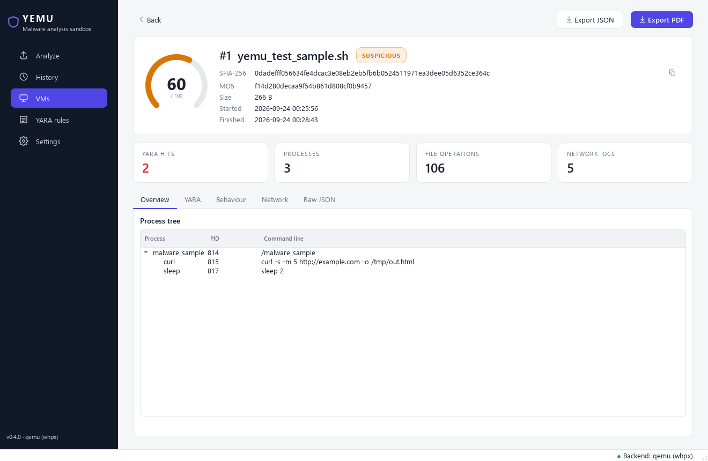
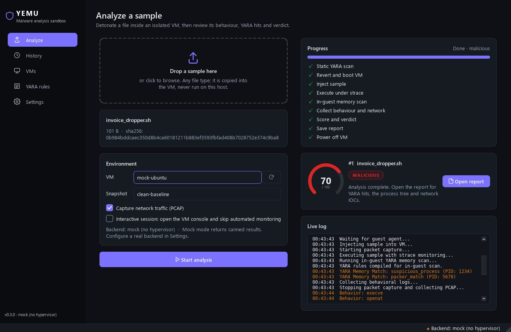

# YEMU

YEMU is a local malware analysis sandbox for Linux and Windows. It runs a sample inside a disposable QEMU virtual machine (KVM on Linux, Windows Hypervisor Platform on Windows), watches what it does, scans it with YARA, and gives it a 0–100 threat score and a verdict. It has a desktop app (Qt, same on both platforms) and a command-line tool (`yemu`).



> [!WARNING]
> This tool executes real malware. Only run samples on a host you are willing to lose, and check the VM network before every run (see [Safety](#safety)). The project is under active development and is not yet hardened for production use.

## How it works

```
 sample ──► static YARA scan (host)
        │
        ├─► revert VM to "clean-baseline" snapshot ─► start VM ─► wait for qemu-guest-agent
        │
        ├─► inject sample into the guest ─► run under strace (+ optional tcpdump)
        │
        ├─► in-guest YARA scan of /proc memory
        │
        ├─► collect strace logs / PCAP ─► parse behaviour & network IOCs
        │
        └─► threat score + verdict ─► SQLite + JSON/PDF report ─► stop VM
```

| Stage | Module |
|---|---|
| Pipeline orchestration | `yemu/core/orchestrator.py` |
| VM backend interface and factory | `yemu/core/vm_backend.py` |
| libvirt backend and mock backend | `yemu/core/vm_manager.py` |
| Standalone QEMU backend (Windows + Linux) and guest-agent client | `yemu/core/qemu_backend.py`, `yemu/core/qga.py` |
| Shared VM preparation flow | `yemu/core/provisioning.py`, `yemu/core/vm_provisioner.py` |
| YARA scanning and rule compilation | `yemu/core/yara_engine.py` |
| Rule sync from GitHub (default: [Yara-Rules/rules](https://github.com/Yara-Rules/rules)) | `yemu/core/yara_sync.py` |
| strace / Procmon parsing | `yemu/core/behaviour_monitor.py` |
| PCAP → IP and domain IOCs (scapy) | `yemu/core/network_capture.py` |
| Scoring and verdict (weights set in config) | `yemu/core/threat_scorer.py` |
| SQLite storage (`samples`, `analyses`, `events`, `iocs`) | `yemu/storage/db.py` |
| JSON and PDF reports | `yemu/storage/report_store.py`, `yemu/core/report_generator.py` |
| Per-user paths and settings | `yemu/paths.py`, `yemu/config.py` |
| CLI and desktop app | `yemu/cli.py`, `yemu/gui/` (PySide6) |
| Normalized report model (shared by the GUI, CLI and PDF) | `yemu/core/report_model.py` |

### Scoring

Only activity from the sample's own process tree (from strace) is scored. Background traffic from the guest OS shows up in the PCAP as IOCs, but it doesn't count.

| Finding | Points |
|---|---|
| Any YARA match (static or in memory) | +40 (+10 more if there are over 3 matches) |
| Connection to a public IP address | +30 |
| Suspicious behaviour: reading sensitive files (`/etc/shadow`, SSH keys, ...); running downloaders, interpreters or system tools (`curl`, `wget`, `nc`, `python`, `crontab`, ...); spawning a shell; deleting files outside `/tmp` | +5 each, max +20 |
| Persistence: writing to cron, systemd units, init scripts, shell profiles, `ld.so.preload` or `authorized_keys` | +10 |

The score is capped at 100. Under 30 is **clean**, 30–69 is **suspicious**, and 70 or more is **malicious**. You can change every weight and threshold in the `[scoring]` section of the config file. Each analysis stores the weights it was scored with and the list of reasons. The report's **Why this verdict** section shows that list.

## Platform support

| Host | CLI (`yemu`) | Real VM analysis | Desktop app |
|---|---|---|---|
| Linux (Ubuntu 22.04+ / Debian 12+) | Yes | Yes: `libvirt` backend (KVM) or `qemu` backend | Yes |
| Windows 10/11 | Yes | Yes: `qemu` backend with WHPX acceleration | Yes |
| Windows through WSL2 | Yes | Yes (needs nested virtualization for KVM speed) | Yes, through WSLg |

YEMU has three VM backends. `[vm].backend = "auto"` (the default) picks the first one that works:

| Backend | Hosts | How it works |
|---|---|---|
| `libvirt` | Linux | libvirt/QEMU-KVM domains, `virsh`, libguestfs, isolated libvirt networks, and live memory snapshots |
| `qemu` | Windows, Linux | Runs `qemu-system-x86_64` directly and talks to the guest agent over a local socket. Uses WHPX, KVM or TCG acceleration. Uses QEMU user-mode networking (`restrict=on` for analysis). Snapshots are qcow2 disk snapshots |
| `mock` | any | Canned responses, so you can explore the UI and CLI without a hypervisor |

Automated analysis needs Linux guests (Ubuntu or Debian cloud images). A Windows 11 guest can be provisioned on the `libvirt` backend, but the automated pipeline (strace, `/proc` scanning) only works on Linux guests today.

## Installation

You need a CPU with VT-x or AMD-V enabled in firmware, and QEMU (or libvirt on Linux) to run real VMs. `yemu doctor` checks everything.

### From a release (no Python needed)

Download from the [Releases](https://github.com/ogshrug/YEMU/releases) page:

| Package | Contents |
|---|---|
| `YEMU-<version>-windows-x64-setup.exe` | Windows installer: Start-menu and desktop shortcuts, and an optional `yemu` entry on PATH. It installs per user by default, so it doesn't need admin. |
| `YEMU-<version>-windows-x64.zip` | Portable Windows build. Unzip it, then run `yemu-gui.exe` or `yemu.exe`. |
| `YEMU-<version>-linux-x86_64.tar.gz` | Linux bundle. Unpack it, then run `./install.sh` (for your user) or `sudo ./install.sh --system`. |
| `yemu-<version>-py3-none-any.whl` | For `pip install` into your own environment. Add `[gui]` for the desktop app. |

Each release lists `SHA256SUMS.txt`. Then install QEMU, or use the setup scripts below for that part, and run `yemu vm create ubuntu-clean`.

### Windows (from source)

```powershell
powershell -ExecutionPolicy Bypass -File scripts\setup_windows.ps1 -CreateVM ubuntu-clean
```

The script:

1. Installs QEMU with winget if it's missing.
2. Checks **Windows Hypervisor Platform** (run it as admin to have the feature enabled for you).
3. Creates `.venv`, installs YEMU into it and runs `yemu doctor`.
4. With `-CreateVM`, it also builds the analysis VM.

To do the same by hand:

```powershell
winget install SoftwareFreedomConservancy.QEMU
# Admin PowerShell, then reboot:
Enable-WindowsOptionalFeature -Online -FeatureName HypervisorPlatform -All
py -m venv .venv
.venv\Scripts\activate
pip install -e ".[gui,dev]"
yemu doctor
yemu vm create ubuntu-clean
yemu gui
```

### Linux, including WSL2 (from source)

```bash
bash scripts/setup_linux.sh               # libvirt + desktop app + CLI
bash scripts/setup_linux.sh --qemu-only   # lighter: standalone QEMU backend + CLI
```

The script installs the apt packages, including the Qt runtime libraries, and adds you to the `libvirt` and `kvm` groups (log out and back in afterwards). It then creates `.venv` with system site-packages, which gives it the distro's libvirt bindings, and runs `pip install -e ".[linux,gui,dev]"`.

Inside **WSL2**, the script also:

- Turns on systemd in `/etc/wsl.conf`, because libvirtd needs it.
- Tells you if `/dev/kvm` is missing. To fix that, add the following to `%UserProfile%\.wslconfig` and run `wsl --shutdown`:
  ```ini
  [wsl2]
  nestedVirtualization=true
  ```
- Inside WSL2, WSLg shows the Linux build of the desktop app. On Windows you can also just run the native app.

## Where data goes

| What | Linux | Windows |
|---|---|---|
| Database, reports, captures, synced rules, logs | `~/.local/share/yemu/` | `%LOCALAPPDATA%\YEMU\` |
| Log file (rotated, 5 × 5 MB) | `~/.local/share/yemu/logs/yemu.log` | `%LOCALAPPDATA%\YEMU\logs\yemu.log` |
| Config file | `~/.config/yemu/config.toml` | `%LOCALAPPDATA%\YEMU\config.toml` |
| VM disks and base images | `/var/tmp/yemu-$USER/` (must be readable by QEMU) | `%LOCALAPPDATA%\YEMU\vms\` |
| `qemu` backend VMs (config, disk, console log) | `<VM storage>/qemu/<name>/` | same |
| Built-in rules (always loaded) | `yemu/rules/default.yar` | same |

`yemu paths` prints the real locations on your machine. Set `YEMU_HOME=<dir>` to keep everything in one folder (portable installs, tests). Set `YEMU_VM_DIR` to move VM storage.

## Configuration

```bash
yemu config --init    # writes a commented config.toml with the defaults
yemu config           # shows the effective settings
```

| Section | Keys |
|---|---|
| `[vm]` | `backend` (`auto`/`libvirt`/`qemu`/`mock`), `default_vm`, `default_snapshot`, `agent_timeout` |
| `[qemu]` | `bin_dir` (where QEMU is installed, if not on PATH), `accel` (`auto`/`whpx`/`kvm`/`hvf`/`tcg`), `extra_args` |
| `[network]` | `name`, `allow_internet` (turns off the isolation warning) |
| `[analysis]` | `execution_wait` (seconds before logs are collected), `timeout`, `max_sample_mb`, `max_events`, `max_pcap_mb` |
| `[scoring]` | score weights and verdict thresholds |
| `[rules]` | `repo_url`, `branch`, `ref` (pin a commit or tag), `max_download_mb` |
| `[ui]` | `theme` (`system`/`light`/`dark`) |

You can also edit all of these on the desktop app's **Settings** page.

## Preparing an analysis VM

The pipeline needs a VM that has **qemu-guest-agent** running and a snapshot named **`clean-baseline`**.

### Automated (recommended, on any host)

```bash
yemu vm create ubuntu-clean               # --distro debian, --ram 4096, --cpus 4, --disk 40, --backend qemu
```

The desktop app's **Prepare New VM** button runs the same flow:

1. Downloads an Ubuntu 24.04 or Debian 12 cloud image. It's cached, so the next VM reuses it.
2. Builds a cloud-init seed. The seed installs `qemu-guest-agent`, `strace`, `tcpdump` and `yara`, sets a random console password and turns off SSH password login.
3. Boots the VM on a **NAT** network so the guest can install its tools (`yemu-provision` on libvirt, user-mode NAT on qemu).
4. Moves the VM onto the **isolated** analysis network: `malware-analysis` with no `<forward>` on libvirt, or `restrict=on` on qemu. Then it checks that the VM can no longer reach the internet.
5. Takes the `clean-baseline` snapshot and prints the console password.

Other VM commands: `yemu vm list`, `yemu vm start <name> [--console]`, `yemu vm stop <name>` and `yemu vm delete <name> --yes` (qemu backend).

`scripts/prepare_vm.sh` is the older zenity-based shell version for libvirt. It follows the same network model and saves the password to `/var/tmp/yemu-$USER/<vm>.credentials`.

### Manual

1. Create a VM in `virt-manager`, for example `ubuntu-clean`.
2. Inside the guest, install and enable the agent and the monitoring tools:
   ```bash
   sudo apt install -y qemu-guest-agent strace tcpdump yara
   sudo systemctl enable --now qemu-guest-agent
   ```
3. Make sure the domain XML has the agent channel:
   ```xml
   <channel type='unix'>
     <target type='virtio' name='org.qemu.guest_agent.0'/>
   </channel>
   ```
4. Attach the VM to the `malware-analysis` network, then take the snapshot:
   ```bash
   virsh snapshot-create-as ubuntu-clean clean-baseline "Clean state for analysis"
   ```

## Usage

### Desktop app (Windows and Linux)

```bash
yemu gui              # or: python main.py, or the yemu-gui launcher
```

| Page | What it does |
|---|---|
| **Analyze** | Drag a file onto the drop zone (or click to browse), pick the VM and snapshot, and optionally turn on PCAP or an interactive console session. While it runs, a stage tracker (revert, inject, execute, memory scan, collect, score) shows progress next to a live log. When it finishes, a result card shows the score and verdict. |
| **History** | Every analysis, with verdict counts, search by file name or ID, and a verdict filter. Double-click a row to open its report. |
| **Report** | Score gauge and verdict. Hashes and times. Counts of YARA hits, processes, file operations and network IOCs. Tabs for the **process tree**, **YARA** matches (with matched strings), a filterable **behaviour** timeline, **network** IOCs and raw JSON. Export to PDF or JSON. |
| **VMs** | Shows the backend and its acceleration, and each VM's state and snapshots. Create a VM (with live progress), start, stop, open its console, or delete it. |
| **YARA rules** | Built-in rules (read-only), your own rules and synced rule sets, in an editor with syntax highlighting. **Validate** compiles the rule, and saving also checks it. Sync rules from any GitHub repo and branch. |
| **Settings** | Backend, default VM and snapshot, timeouts, QEMU folder and acceleration, the network-isolation override, theme and rule source. Also shows where data is stored, and **Run checks** runs `yemu doctor`. |

Shortcuts: `Ctrl+O` opens a sample, and `Ctrl+1` to `Ctrl+5` switch pages. The theme follows the system light/dark setting unless you set one in Settings.



### Command line (Linux and Windows)

```bash
yemu vm create ubuntu-clean                  # once
yemu analyze sample.bin                      # uses [vm] defaults from config
yemu analyze sample.bin --vm ubuntu-clean --snapshot clean-baseline --pcap
yemu analyze sample.bin --backend mock --json
yemu reports                                  # recent analyses
yemu report 12                                # one analysis + events, as JSON
yemu list-vms
yemu sync-rules [--repo URL --branch BRANCH --ref SHA_OR_TAG]
yemu paths | yemu config [--init] | yemu doctor
```

`yemu analyze` exit codes for scripts and pipelines:

| Code | Meaning |
|---|---|
| 0 | Done; verdict is `clean` or `suspicious` |
| 3 | Done; verdict is `malicious` |
| 4 | The analysis `failed` or hit its `timeout`; the verdict is based on partial results |
| 1 / 2 | It couldn't start (bad sample, no backend, database error) |

Each analysis ends with a **status**: `completed`, `failed` (the VM couldn't be prepared safely), `timeout`, or `manual` (interactive session). If YEMU was killed mid-run, the status is `interrupted`.

## Safety

Read [docs/threat-model.md](docs/threat-model.md) before analysing real malware. It covers what YEMU protects, the trust boundaries between host and guest, and the risks you still have to manage, such as hypervisor escapes, host-side parsers and evasion. To report a vulnerability, see [SECURITY.md](SECURITY.md).

The most important points:


- **The analysis network is offline by default.** Before every run, YEMU checks the VM's interfaces. If any interface can reach the host LAN or the internet, it logs a `CRITICAL` warning. On libvirt that means a NAT or routed network, or a bridge/direct interface. On qemu it means user-mode networking without `restrict=on`. To deliberately give samples internet access, provision with `YEMU_ALLOW_INTERNET=1 bash scripts/prepare_vm.sh`, and set `allow_internet = true` under `[network]` in the config.
  ```bash
  virsh net-dumpxml malware-analysis   # an isolated network has no <forward> element
  ```
- VMs created by older versions of the script used a NAT network and the fixed password `analysis-password`. Re-run **Prepare New VM** to rebuild them.
- Guest SSH password login is disabled. YEMU talks to the guest only through qemu-guest-agent. Treat the guest as untrusted and never bridge it to your LAN.
- **A sample never runs on a dirty VM.** If the snapshot revert, the boot, the guest agent or the injection fails, the analysis is marked `failed` before anything executes.
- **Every run has hard limits**, set under `[analysis]` in the config:

  | Setting | Default | What it does |
  |---|---|---|
  | `timeout` | 900 s | After this, the analysis stops and the VM is powered off |
  | `max_sample_mb` | 256 | Larger samples are refused |
  | `max_events` | 20000 | Behaviour events stored per analysis |
  | `max_pcap_mb` | 200 | Larger captures aren't copied back to the host |

  The VM is always powered off at the end, even after a crash.
- **Guest output is treated as hostile.** Each run uses a random working folder in the guest (`/tmp/yemu-<random>`). All guest commands are shell-quoted. File names read back from the guest are checked against a strict pattern. The in-guest memory scan only looks at the sample's own processes.
- **YARA rule sync is pinned and sandboxed.**
  - The branch is resolved to an exact commit, which is recorded in the manifest. To pin a tag or SHA, set `[rules].ref`.
  - Downloads (`max_download_mb`) and individual rule files are size-capped.
  - Archive paths can't escape the rules folder.
  - Every rule must compile.
  - The new rule set replaces the old one atomically.
- Always analyse from a reverted snapshot. The pipeline reverts automatically, but manual (GUI) sessions leave the VM running.

## Development

```bash
pip install -e ".[gui,dev]" ruff mypy
ruff check yemu tests && ruff format --check yemu tests && mypy && pytest -q
python scripts/build.py [--installer]   # wheel, sdist, PyInstaller bundle (+ Windows installer), smoke-tested
```

Tests live in `tests/`. CI (`.github/workflows/tests.yml`) runs lint and type checks, then runs the tests on Ubuntu and Windows with Python 3.10 and 3.12. Pushing a `vX.Y.Z` tag builds and publishes a release (`.github/workflows/release.yml`). See [CONTRIBUTING.md](CONTRIBUTING.md) for guidelines. None of them need a real VM, and they never write to your real data folders, because each test gets its own `YEMU_HOME`.

## Troubleshooting

| Symptom | Fix |
|---|---|
| `Failed to connect socket to '/var/run/libvirt/libvirt-sock': Permission denied` | Add yourself to the `libvirt` and `kvm` groups and log in again. The app falls back to `qemu:///session` automatically. |
| `virt-copy-in` / libguestfs: `cannot access /boot/vmlinuz` | `sudo chmod +r /boot/vmlinuz-*`. The app already sets `LIBGUESTFS_BACKEND=direct`. |
| "VM not found" | Check `virsh list --all`. The name must match exactly. |
| Guest agent timeout | Check that the agent channel exists in the domain XML and that `systemctl status qemu-guest-agent` shows it running in the guest. |
| `malware-analysis` network missing | The app tries to create it. To create it manually, use `virsh net-define <xml>`, then `virsh net-start malware-analysis` and `virsh net-autostart malware-analysis`. |
| `yemu gui` says PySide6 is missing | `pip install -e ".[gui]"`. On Linux, also install `libegl1 libxkbcommon-x11-0 libxcb-cursor0` (the setup script does this). |
| App shows "Mock Mode" | No backend is available. Run `yemu doctor`: it checks QEMU, acceleration, libvirt and your groups. |
| Windows: `doctor` reports `tcg` instead of `whpx` | Enable **Windows Hypervisor Platform** (see Installation) and reboot. TCG works, but it's slow. |
| Windows: QEMU exits with `WHPX: Unexpected VP exit code 4` | Don't force a CPU model. Remove `-cpu` from `[qemu].extra_args`. YEMU already uses the default CPU model under WHPX. |
| An analysis shows `failed` | The report's banner and `yemu report <id>` show the reason, for example a missing snapshot or an agent that didn't answer. `yemu.log` has the full trace. |
| Database upgrade | YEMU migrates its SQLite schema automatically when it starts (`PRAGMA user_version`). Older databases are upgraded in place. |
| qemu backend: guest agent timeout during `vm create` | Look at `<VM storage>/qemu/<name>/console.log` to follow cloud-init, and at `qemu.log` for QEMU errors. |

## Project layout

```
yemu/
  app.py             desktop app launcher
  gui/               PySide6 app: main window, theme, widgets, pages/ (analyze, history, report, vms, rules, settings)
  cli.py             `yemu` command-line interface
  paths.py           per-user data/config/cache locations
  config.py          config.toml loading and defaults
  core/              pipeline, VM backends (libvirt, qemu, mock), guest agent, YARA, parsing, scoring, provisioning
  storage/           SQLite access layer and report writer
  rules/default.yar  built-in YARA rules
packaging/                 PyInstaller spec, Windows installer (Inno Setup), Linux .desktop + install.sh
scripts/build.py           builds release artifacts
scripts/setup_windows.ps1  one-shot Windows setup (QEMU, WHPX check, venv)
scripts/setup_linux.sh     one-shot Linux / WSL2 setup
scripts/prepare_vm.sh      shell version of VM preparation (libvirt)
tests/               pytest suites
main.py              compatibility launcher for the GUI
docs/threat-model.md       what YEMU defends against and what it doesn't
```
